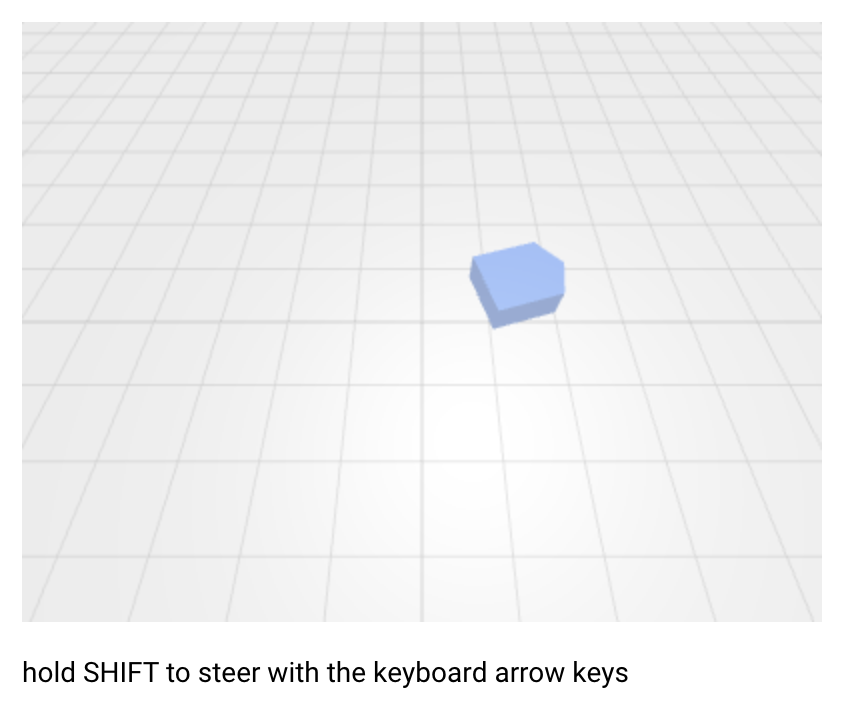

# Getting Started

First [install RoSys](installation.md) with pip or Docker.
Then create a directory to host your code and put it under version control.
Name your entry file `main.py` and add the following content:

```Python
{!../main.py!}
```

If you launch the program, your browser will open the url <http://0.0.0.0:8080/> and present a 3d view:

{: style="width:60%"}

## Explanation

### Imports

The [user interface](#user_interface) is built with [NiceGUI](https://nicegui.io).
The individual RoSys modules come in packages `driving`, `geometry`, `hardware` and others.

### Setup

In this example we create a `Steerer` which needs an `Odometer`.
Here we work without real hardware, so two wheels are simulated.
Please see [Hardware](examples/hardware.md) for an example which can actually be used on a mobile robot.
For visualization purposes we also need the approximate robot shape.

### User Interface

The user interface consists of keyboard control with access to the steerer as well as a 3D view of the scene.
The latter only contains the `RobotObject` with the given shape.
The robot pose is constantly updated from the odometer.
See [NiceGUI](https://nicegui.io) for more details about its API.

### Start

[NiceGUI](https://nicegui.io) provides a `ui.run` command which launches the web server and opens the corresponding web application.
If you modify the code, a reload is triggered automatically.
This is very convenient, but can be deactivated by passing `reload=False`.
