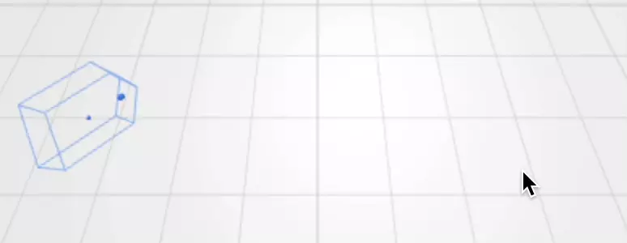

# User Interface

RoSys plays very well with [NiceGUI](https://nicegui.io/) and provides additional robot-related components through the `rosys.ui` package.
NiceGUI is a high-level web UI framework on top of [JustPy](https://justpy.io/).
This means you can write all UI code in Python.
The state is automatically reflected in the browser through websockets.
RoSys can also be used with other user interfaces or interaction models if required.
For example a completely app-based control through Bluetooth LE with Flutter.

## Configure

To make RoSys UI elements aware of the RoSys runtime you must call `rosys.ui.configure`:

```Python hl_lines="5-6"
from nicegui import ui
import rosys
import rosys.ui

runtime = rosys.Runtime()
rosys.ui.configure(ui, runtime)
```

Afterwards you can use the UI elements provided by RoSys (see below).

## Keyboard Control

By calling `rosys.ui.keyboard_control()` you enable steering the robot with the keyboard (see [Getting Started](getting_started.md) for a full example).
Press the arrow keys to steer the robot while holding the SHIFT key down.
You can also modify the speed of the robot by pressing the keys 1-4.
Use the optional parameter `default_speed` to change the initally chosen value.

## Joystick

When operating from a mobile phone, you can use `rosys.ui.joystick()` to create an UI element with touch control.
You can drive the robot by dragging the mouse inside the top left square:

{: style="width:50%"}

## 3D Scene

### Robot and Shape

It's often desired to visualize all the informations which the robot has about the world.
To do so you can create a 3d scene with [NiceGUI](https://nicegui.io).
RoSys provides an `robot_object` to render and update the robot:

```python hl_lines="10 12"
shape = rosys.RobotShape(outline=[
    (0, 0), (-0.5, -0.5),
    (1.5, -0.5), (1.75, 0),
    (1.5, 0.5), (-0.5, 0.5)]
    ) # the shape for the robot will be used in 3d rendering
world = World(robot=rosys.Robot(shape=shape))
runtime = rosys.Runtime(world)
rosys.ui.configure(ui, runtime)

with ui.scene() as scene:
    # By passing `debug=True` to the robot 3d object you will see the wireframe, axis-center and follow-the-line target
    robot = rosys.ui.robot_object(debug=True)
    # every 50 ms refresh the robots position
    ui.timer(0.05, robot.update)
```

### Click Handler

You can also pass a click handler to the 3d scene.
Here is a full example example for driving to a point on the ground by starting the build in automation called `drive_to`:

```python hl_lines="11 18"
{!scene_on_click.py!}
```

{: style="width:60%"}
